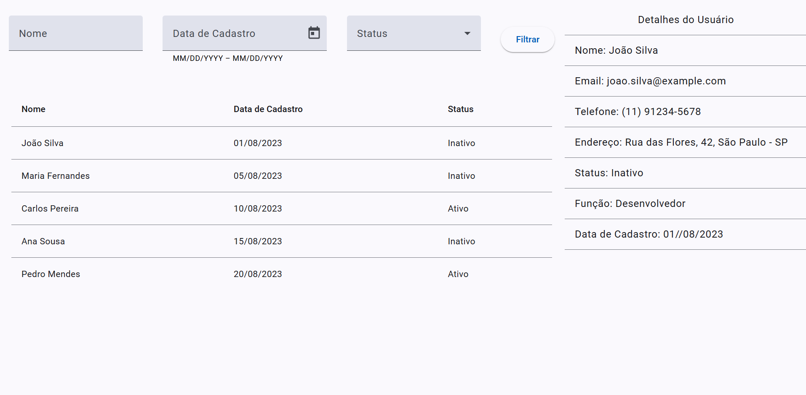

# UsersFilterProject

This simple project was developed as part of a course, with the aim of practicing and improving skills in Angular 18 (without standalone usage). It does not include an API; instead, mock data is used to simulate backend responses.

## Features

This system provides user management functionalities as follows:

- Search Filters: Allows users to search by name, registration date, and status. The filters include a name field, a date range selector, and a status dropdown (active/inactive), enabling more targeted searches.

- User List: Displays a list of users with details such as name, registration date, and status. The list provides quick access to the main information of each user.

- User Details: By selecting a user from the list, a panel displays detailed information, including name, email, phone, address, status, role, and registration date. This allows in-depth access to specific user data.

- Filter Button: A "Filter" button applies the defined filters, updating the list according to the chosen criteria.

## Preview

